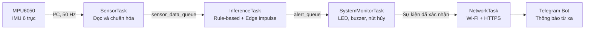
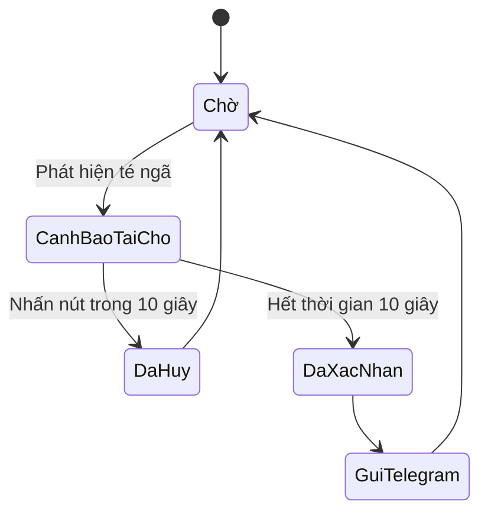

# Fall Detection AIoT Device

> Thiết bị phát hiện té ngã sử dụng ESP32, xử lý chuyển động theo thời gian thực, cảnh báo tại chỗ và gửi thông báo từ xa qua Telegram.

## 📌 Tổng quan dự án

Fall Detection AIoT Device là một hệ thống an toàn nhúng được xây dựng bằng ESP-IDF, FreeRTOS và cảm biến quán tính MPU6050. Firmware lấy mẫu gia tốc 3 trục và vận tốc góc 3 trục ở tần số 50 Hz, xử lý dữ liệu trực tiếp trên ESP32 và đánh giá nguy cơ té ngã bằng máy trạng thái rule-based thử nghiệm kết hợp mô hình TinyML từ Edge Impulse.

Khi phát hiện sự kiện có khả năng là té ngã, thiết bị kích hoạt cảnh báo tại chỗ bằng LED và buzzer. Người dùng có 10 giây để hủy cảnh báo sai bằng nút nhấn. Nếu cảnh báo không bị hủy, firmware xác nhận sự kiện và gửi thông báo qua Telegram Bot bằng kết nối Wi-Fi.

> [!NOTE]
> Đây là nguyên mẫu kỹ thuật phục vụ nghiên cứu và phát triển, không phải thiết bị y tế hoặc thiết bị an toàn đã được chứng nhận.

## ✨ Tính năng chính

- Đọc chuyển động 6 trục theo thời gian thực từ MPU6050
- Lấy mẫu ổn định ở 50 Hz bằng FreeRTOS task
- Thuật toán phát hiện té ngã rule-based thử nghiệm với các trạng thái rơi tự do, va chạm và kiểm tra tư thế
- Tích hợp suy luận Edge Impulse/TinyML với mô hình TensorFlow Lite đã biên dịch
- Cảnh báo tại chỗ bằng LED nhấp nháy và buzzer phát theo chu kỳ
- Nút hủy có xử lý chống dội để giảm cảnh báo sai gửi từ xa
- Gửi thông báo Telegram Bot qua Wi-Fi và HTTPS
- Hỗ trợ xuất dữ liệu cảm biến dạng CSV qua serial monitor để xây dựng tập dữ liệu
- Có sẵn dữ liệu chuyển động đã gắn nhãn cho `fall_soft`, `lying`, `normal` và `shake`
- Kiến trúc firmware ESP-IDF dạng module, giao tiếp giữa các task bằng FreeRTOS queue

## 🧩 Kiến trúc hệ thống



Firmware tách biệt quá trình đọc cảm biến có yêu cầu thời gian nghiêm ngặt khỏi khâu suy luận, tương tác người dùng và truyền dữ liệu mạng:

1. `vSensorTask` đọc và chuẩn hóa dữ liệu gia tốc kế, con quay hồi chuyển từ MPU6050 sau mỗi 20 ms.
2. `vInferenceTask` tính độ lớn gia tốc và vận tốc góc, chạy máy trạng thái rule-based và mô hình Edge Impulse.
3. `vSystemMonitorTask` điều khiển cảnh báo tại chỗ và theo dõi nút hủy.
4. `vNetworkTask` duy trì kết nối Wi-Fi và gửi sự kiện đã xác nhận tới Telegram.

Các FreeRTOS queue giúp cô lập từng giai đoạn, tránh để độ trễ mạng làm gián đoạn quá trình lấy mẫu cảm biến.

## 🔍 Quy trình phát hiện té ngã

### Bộ phát hiện rule-based

Máy trạng thái hoạt động theo trình tự:

```text
NORMAL → FREE_FALL → IMPACT → POSTURE_CHECK → CONFIRMED
```

Các điều kiện được đánh giá gồm:

- Rơi tự do khi gia tốc nhỏ hơn `0.5 g`
- Va chạm khi gia tốc lớn hơn `2.5 g`
- Tư thế ổn định sau va chạm khi gia tốc nằm trong khoảng `0.8 g` đến `1.2 g`
- Vận tốc góc nhỏ hơn `30 °/s`
- Duy trì tư thế ổn định trong 3 giây để xác nhận

Một va chạm cũng có thể khởi động trực tiếp chuỗi phát hiện khi không ghi nhận được mẫu rơi tự do trước đó.

> [!IMPORTANT]
> MPU6050 hiện được cấu hình với dải đo gia tốc ±2 g, trong khi ngưỡng va chạm của thuật toán rule-based là 2.5 g. Vì vậy, cần hiệu chỉnh lại dải đo hoặc ngưỡng trước khi nhánh rule-based có thể xác nhận va chạm một cách tin cậy. Nhánh TinyML tích hợp vẫn hoạt động độc lập.

### Bộ phân loại Edge Impulse

Suy luận TinyML đang được bật trong cấu hình hiện tại. Mô hình sensor fusion được triển khai với:

- Cửa sổ 2 giây, gồm 100 mẫu ở 50 Hz
- Tám kênh đầu vào: `ax`, `ay`, `az`, `gx`, `gy`, `gz`, độ lớn gia tốc và độ lớn vận tốc góc
- Bước trượt 25 mẫu, tạo kết quả suy luận mới sau khoảng mỗi 500 ms kể từ khi cửa sổ đầu tiên đầy
- Bốn lớp: `fall_soft`, `lying`, `normal` và `shake`
- Ngưỡng tin cậy mặc định `0.80` cho lớp `fall_soft`

Một trong hai bộ phát hiện đều có thể tạo sự kiện té ngã. Các công tắc tính năng và tham số phát hiện được định nghĩa trong `main/app_config.h`.

### Vòng đời cảnh báo



Luồng phát hiện có thời gian chờ 10 giây giữa các cảnh báo. Thông báo từ xa sử dụng khoảng chờ riêng là 30 giây.

## 🔌 Phần cứng

### Linh kiện cần thiết

- Board phát triển ESP32
- Module gia tốc kế và con quay hồi chuyển MPU6050
- LED và điện trở hạn dòng phù hợp
- Buzzer chủ động hoặc buzzer có mạch kích ngoài phù hợp với GPIO
- Nút nhấn nhả
- Breadboard và dây nối

### Cấu hình chân mặc định

| Chức năng | GPIO ESP32 | Ghi chú |
|---|---:|---|
| MPU6050 SDA | 21 | Dữ liệu I²C |
| MPU6050 SCL | 22 | Xung clock I²C |
| LED | 26 | Tích cực mức cao |
| Buzzer | 27 | Tích cực mức cao |
| Nút hủy | 32 | Tích cực mức thấp, bật điện trở kéo lên nội |

MPU6050 sử dụng địa chỉ I²C `0x68`. Chân ngắt của cảm biến được dành sẵn tại GPIO 19 trong file cấu hình nhưng chưa được firmware sử dụng do hệ thống hiện đọc dữ liệu theo cơ chế polling.

> [!CAUTION]
> Cần kiểm tra điện áp và dòng điện của module MPU6050, LED và buzzer trước khi kết nối với ESP32. Hãy sử dụng mạch kích transistor nếu buzzer yêu cầu dòng lớn hơn giới hạn an toàn của GPIO.

## 🛠️ Yêu cầu phần mềm

- ESP-IDF 5.3.x; cấu hình hiện tại của dự án được tạo bằng ESP-IDF 5.3.3
- Bộ công cụ ESP32 và kết nối USB hỗ trợ serial
- Mạng Wi-Fi 2.4 GHz để gửi thông báo từ xa
- Telegram Bot và cuộc trò chuyện đích để kiểm thử thông báo

File `sdkconfig` trong repository được cấu hình cho ESP32 nguyên bản, flash 4 MB và bảng phân vùng single-app large.

## 🚀 Bắt đầu sử dụng

### 1. Clone repository

```bash
git clone <repository-url>
cd Fall_Detection_AIot
```

### 2. Cấu hình thông tin kết nối an toàn

Tạo các file cấu hình cục bộ từ file mẫu có sẵn:

```bash
cp main/wifi_credentials_example.h main/wifi_credentials.h
cp main/telegram_credentials_example.h main/telegram_credentials.h
```

Trên PowerShell:

```powershell
Copy-Item main/wifi_credentials_example.h main/wifi_credentials.h
Copy-Item main/telegram_credentials_example.h main/telegram_credentials.h
```

Chỉ chỉnh sửa hai file cục bộ vừa tạo để thêm cấu hình Wi-Fi và Telegram của bạn. Cả hai file đều đã được loại trừ trong `.gitignore`; tuyệt đối không commit hoặc dán nội dung của chúng vào issue, log hay tài liệu.

Dự án vẫn có thể biên dịch bằng các header mẫu, nhưng chức năng Wi-Fi và Telegram cần cấu hình cục bộ hợp lệ để hoạt động.

### 3. Build, nạp firmware và theo dõi log

Mở terminal ESP-IDF và chạy:

```bash
idf.py set-target esp32
idf.py build
idf.py -p <PORT> flash monitor
```

Thay `<PORT>` bằng cổng serial của board, ví dụ `COM5` trên Windows hoặc `/dev/ttyUSB0` trên Linux. Nhấn `Ctrl+]` để thoát ESP-IDF monitor.

Khi khởi động, firmware khởi tạo NVS, quét bus I²C, xác minh định danh MPU6050, khởi động Wi-Fi, tạo các queue và chạy bốn FreeRTOS task.

## ⚙️ Cấu hình ứng dụng

Các thiết lập chính được tập trung trong `main/app_config.h`:

| Tham số | Mặc định | Chức năng |
|---|---:|---|
| `SENSOR_SAMPLE_RATE_HZ` | `50` | Tần số lấy mẫu MPU6050 |
| `ENABLE_SENSOR_CSV_LOG` | `0` | Bật dữ liệu CSV qua serial |
| `SENSOR_CSV_LABEL` | `fall_soft` | Nhãn được thêm khi thu thập dữ liệu |
| `ENABLE_EDGE_IMPULSE_MODEL` | `1` | Biên dịch và chạy mô hình TinyML |
| `EDGE_IMPULSE_FALL_THRESHOLD` | `0.80` | Độ tin cậy tối thiểu của lớp `fall_soft` |
| `EDGE_IMPULSE_REQUIRED_CONSECUTIVE_WINDOWS` | `1` | Số cửa sổ suy luận dương liên tiếp cần thiết |

Chân GPIO và địa chỉ I²C của MPU6050 cũng được cấu hình trong file này.

## 📊 Thu thập dữ liệu và TinyML

Đặt `ENABLE_SENSOR_CSV_LOG` thành `1` và chọn `SENSOR_CSV_LABEL` phù hợp để xuất dữ liệu theo định dạng:

```text
timestamp_ms,ax_g,ay_g,az_g,gx_dps,gy_dps,gz_dps,A,G,label
```

Ghi lại đầu ra serial thành file `.csv` trước khi sử dụng cho quá trình huấn luyện mô hình. Thư mục `data_logs/` chứa các phiên dữ liệu mẫu cho cả bốn lớp.

Thư viện Edge Impulse C++ và mô hình đã biên dịch được tích hợp tại `components/edge_impulse/`. File `main/ei_inference_wrapper.cpp` cung cấp giao diện tương thích C giữa ứng dụng ESP-IDF và API suy luận C++ được sinh tự động.

## 📁 Cấu trúc dự án

```text
Fall_Detection_AIot/
├── CMakeLists.txt
├── sdkconfig
├── main/
│   ├── CMakeLists.txt
│   ├── main.c
│   ├── app_config.h
│   ├── ei_inference_wrapper.cpp
│   ├── ei_inference_wrapper.h
│   ├── wifi_credentials_example.h
│   └── telegram_credentials_example.h
├── components/
│   └── edge_impulse/
│       ├── CMakeLists.txt
│       ├── model-parameters/
│       ├── tflite-model/
│       └── edge-impulse-sdk/
└── data_logs/
    └── *.csv
```

## 🔐 Lưu ý bảo mật

- Giữ `main/wifi_credentials.h` và `main/telegram_credentials.h` ở máy cục bộ, không đưa vào Git.
- Chỉ sử dụng các file `*_credentials_example.h` có sẵn làm mẫu.
- Thu hồi và thay Telegram Bot Token ngay lập tức nếu thông tin này bị lộ.
- Xem dữ liệu serial là thông tin có khả năng nhạy cảm nếu các phiên bản sau bổ sung dữ liệu thiết bị, người dùng hoặc vị trí.
- Khi phát triển thành sản phẩm, nên cấp phát bí mật qua quy trình bảo mật thay vì lưu cố định trong header.

## Phạm vi hiện tại

Các chức năng đã được triển khai và tích hợp:

- Đọc và chuẩn hóa dữ liệu MPU6050 bằng polling
- Bộ phát hiện rule-based thử nghiệm và bộ phát hiện Edge Impulse tích hợp
- Cảnh báo tại chỗ và hủy cảnh báo sai
- Tự động xử lý kết nối lại Wi-Fi ở chế độ station
- Gửi thông báo Telegram qua HTTPS
- Thu thập dữ liệu CSV qua serial

Các hạng mục để hoàn thiện thành sản phẩm—như giám sát pin, cấp phát thông tin kết nối có mã hóa, cập nhật OTA, thiết kế vỏ, kiểm thử dài hạn và chứng nhận an toàn—nằm ngoài phạm vi của nguyên mẫu hiện tại.

Các ngưỡng rule-based cũng cần được hiệu chỉnh theo phần cứng thực tế, bao gồm việc đồng bộ dải đo MPU6050 với ngưỡng va chạm.

## Giấy phép

Repository hiện chưa có giấy phép chung ở cấp dự án. Edge Impulse SDK và các thành phần mô hình được sinh tự động vẫn tuân theo điều khoản giấy phép đi kèm trong các file tương ứng.
